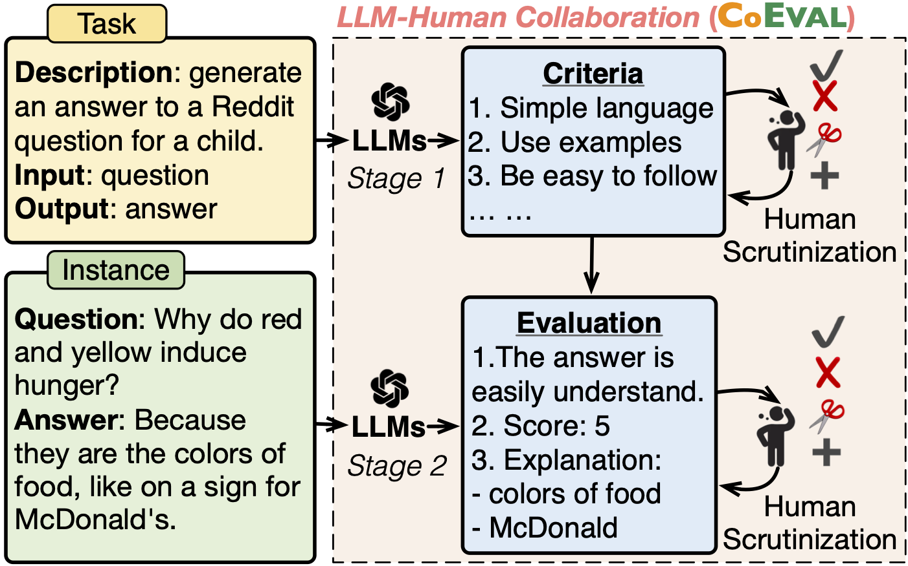
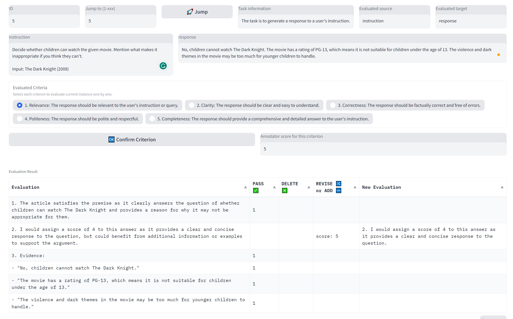
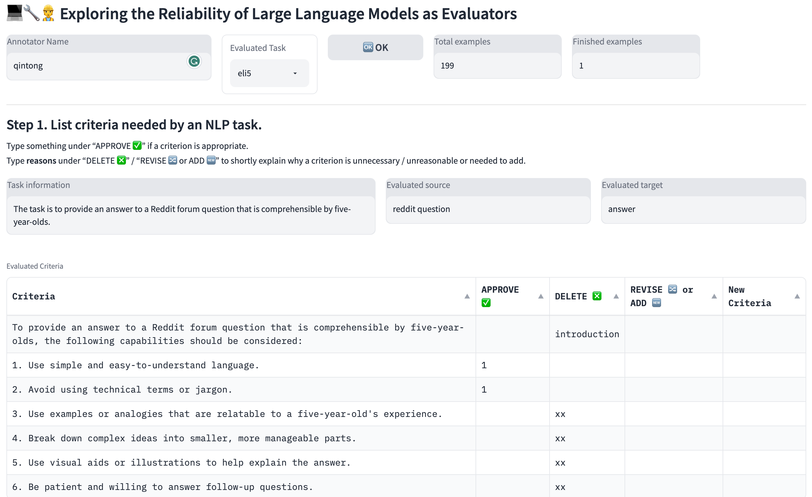
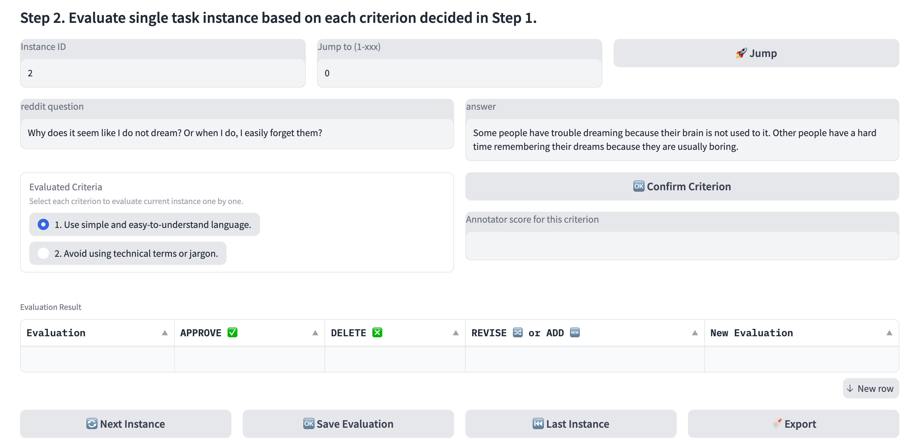

<div align= "center">
    <h1>   CoEval </h1>
</div>

<p align="center">
  <a href="#whats-new">News</a> •
  <a href="#setup">Setup</a> •
  <a href="#serving-with-web-gui">Web GUI</a> •
  <a href="#human-evaluation-data">Evaluation Data</a> •
  <a href="https://arxiv.org/">Paper</a> •
  <a href="http://35.229.128.245:7860/">Demo</a> •
  <a href="#citation">Citation</a> •
</p>

<br>
<div align="center">

</div>
<br>

CoEval is a collaborative LLM-human evaluation pipeline in the text generation field, in which LLM generates preliminary evaluations, then humans scrutinize and revise them to ensure their trustworthiness.
In this repository, you can (1) easily build a evaluation criteria by writing task-specific instruction (2) perform instance-level evaluation.

[comment]: <> (- **A demo of using BMTools to manipulate tools for meta analysis.**)

[comment]: <> (<div align="center">)

[comment]: <> ()

[comment]: <> (</div>)


## What's New


- **[2023/6/30]** The pipeline code and evaluation data is released.

[comment]: <> (- **[older]** [Auto-GPT]&#40;https://github.com/Significant-Gravitas/Auto-GPT&#41; and [BabyAGI]&#40;https://github.com/yoheinakajima/babyagi&#41; are supported in BMTools.)


## Setup
```bash
git clone git@github.com:qtli/CoEval.git
cd CoEval
pip install --upgrade pip
pip install -r requirements.txt
```

We have processed instances of three tasks (ELI5, ROCStories, and Self-Instruct) and stored the processed data as `data/combine_data.json` by running:
```bash
cd data
python3 prop_eval_data.py --stage prepare_test_instance
python3 prop_eval_data.py --stage model_prediction --max_num_tokens 512
python3 prop_eval_data.py --stage combine_model_prediction
python3 prop_eval_data.py --stage llm_eval --max_num_tokens 256 --temperature 0 --top_p 1.0 --frequency_penalty 0 --presence_penalty 0 
```


## Serving with Web GUI
This web GUI is inspired by the open-source project [FastChat](https://github.com/lm-sys/FastChat) and optimized for the usage of LLM-human collaborative evaluation tools, striving to evaluate arbitrary text generation tasks.

There are three main components to use the web UI: web servers that interface with users, model workers that host evaluation models, and a controller to coordinate the webserver and model workers. You can learn more about the architecture [here](https://github.com/lm-sys/FastChat/blob/main/docs/server_arch.md).

### Launch the controller
```bash
cd ../webapp
python3 -m controller --host 127.0.0.1
```
Controller manages the distributed workers.

### Launch the model worker(s)
```bash
python3 -m model_worker --model-name gpt-3.5-turbo-0301 --worker-address http://127.0.0.1:21002 --controller-address http://127.0.0.1:21001 --host 127.0.0.1
```
Wait until the process finishes loading the model and you see "Uvicorn running on ..." in a logger file. 
The model worker will register itself to the controller .


### Launch the Gradio web server (Option 1: only instance-level evaluation)
You could opt to directly evaluate a task instance based on evaluation criteria that have been established. 

The evaluation result of ChatGPT has been prepared in `combine_data.json` for fast experience. Run:
```bash
python3 -m instance_eval_server --eval-data-name ../data/combine_data.json --controller http://127.0.0.1:21001 --host 127.0.0.1 --invoke_mode offline
```

We also provide an online version but the evaluation results could be returned slowly:
```bash
python3 -m instance_eval_server --controller http://127.0.0.1:21001 --host 127.0.0.1 --model-name gpt-3.5-turbo-0301 --invoke-mode online --eval-data-name ../data/combine_data.json
```



### Launch the Gradio web server (Option 2: task-level criteria establishment and instance-level evaluation)
You could opt to establish a custom-designed evaluation criteria set for NLP tasks. And then evaluate task instances based on these criteria.

Run:
```bash
python3 -m criteria_to_eval_server --controller http://127.0.0.1:21001 --host 127.0.0.1 --model-name gpt-3.5-turbo-0301 --invoke-mode online --eval-data-name ../data/combine_data.json
```


<br>



## Human Evaluation Data
Through CoEval pipeline, we collect human evaluation data of LLM-generated task-level criteria and instance-level evaluation data.

We consider three NLP tasks: [ELI5](https://facebookresearch.github.io/ELI5/), [ROCStories](https://cs.rochester.edu/nlp/rocstories/), and [Self-Instruct](https://github.com/yizhongw/self-instruct/blob/main/human_eval/user_oriented_instructions.jsonl).
The human evaluation data of five evaluators for the three task are stored in `webapp/evaluation_data/ELI5`, `webapp/evaluation_data/ROCStories`, and `webapp/evaluation_data/Self-Instruct`.


## Citation
If you use CoEval in your research, please cite:

```bibtex
@misc{li2023coeval,
      title={Collaborative Evaluation: Exploring the Synergy of Large Language Models and Humans for Open-ended Generation Evaluation}, 
      author={Qintong Li and Leyang Cui and Lingpeng Kong and Wei Bi},
      year={2023},
      archivePrefix={arXiv},
      primaryClass={cs.CL}
}
```
